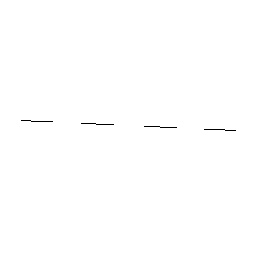
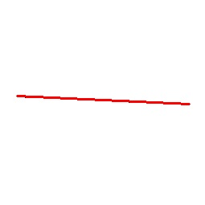
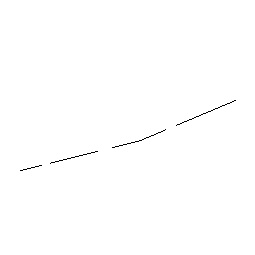
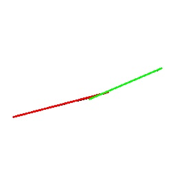
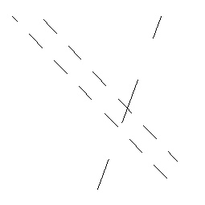
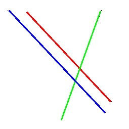

# Práctica #: Transformada de Hough

La transformada de Hough sirve para detectar líneas rectas, incluso si están cortadas. A continuación se presentan una serie de casos de prueba con los que se explorará la transformada de Hough.

## Instrucción

A partir del siguiente código, modifica los parámetros de la transformada de Hoguh de manera que se obtengan las líneas continuas deseadas para cada caso. Muestra tus resultados, anota los parámetros que usaste y justifica los cambios. Posteriormente, responde las siguientes preguntas:

1. ¿Qué es el parámetro *ρ* (rho)?
2. ¿Qué es el parámetro *θ* (theta)?
3. ¿Qué es el parámetro *threshold*?
3. ¿Qué es el parámetro *minLineLength*?
3. ¿Qué es el parámetro *maxLineGap*?

NOTA: Para cada caso se presentan dos imágenes. la imagen con las líneas coloreadas es el resultado que se espera obtener.

```python
import cv2
import sys
import numpy as np

colors = [
    (0, 0, 255),
    (0, 255, 0),
    (255, 0, 0),
    (255, 255, 0),
    (255, 0, 255),
    (0, 255, 255),
]

def lines_too_close(a, b, threshold):
    def dist(x1, y1, x2, y2):
        d = ((x2 - x1)**2 + (y2 - y1)**2)**0.5
        return d

    ax1, ay1, ax2, ay2 = a
    bx1, by1, bx2, by2 = b

    return (
        (
            dist(ax1, ay1, bx1, by1) < threshold and
            dist(ax2, ay2, bx2, by2) < threshold
        ) or (
            dist(ax1, ay1, bx2, by2) < threshold and
            dist(ax2, ay2, bx1, by1) < threshold
        )
    )

def cleanup(lines):
    while True:
        change = False

        for i in range(len(lines)):
            for j in range(len(lines)):
                if i == j: continue

                if lines_too_close(lines[i][0], lines[j][0], 15):
                    lines = np.delete(lines, j, 0)
                    change = True
                    break

            if change: break
        if not change:
            break

    return lines

img = cv2.imread(sys.argv[1])
gray = cv2.cvtColor(img, cv2.COLOR_BGR2GRAY)

edges = cv2.Canny(gray, 20, 20)

lines = cv2.HoughLinesP(
    edges,
    1,
    np.pi / 180,
    90,
    minLineLength=15,
    maxLineGap=18
)

# si hay dos líneas muy cerca una de la otra, elimina una
lines = cleanup(lines)

i = 0
for line in lines:
    x1, y1, x2, y2 = line[0]
    cv2.line(img, (x1, y1), (x2, y2), colors[i % len(colors)], 2)
    i += 1

cv2.imshow('lines', img)
cv2.waitKey(0)
```

## Caso 1




| $\rho$ | $\theta$ | threshold | minLineLength | maxLineGap |
| - | - | - | - | - |
| $\ $ | |  |  |  |

## Caso 2




| $\rho$ | $\theta$ | threshold | minLineLength | maxLineGap |
| - | - | - | - | - |
| $\ $ | |  |  |  |

## Caso 3




| $\rho$ | $\theta$ | threshold | minLineLength | maxLineGap |
| - | - | - | - | - |
| $\ $ | |  |  |  |
